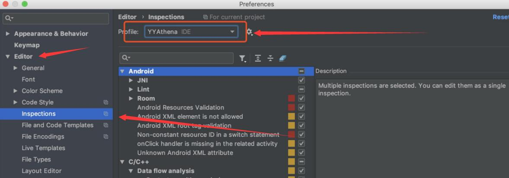
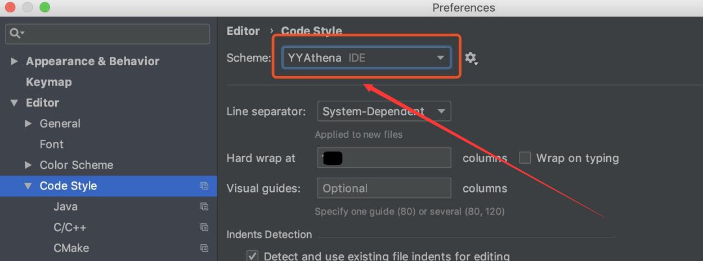
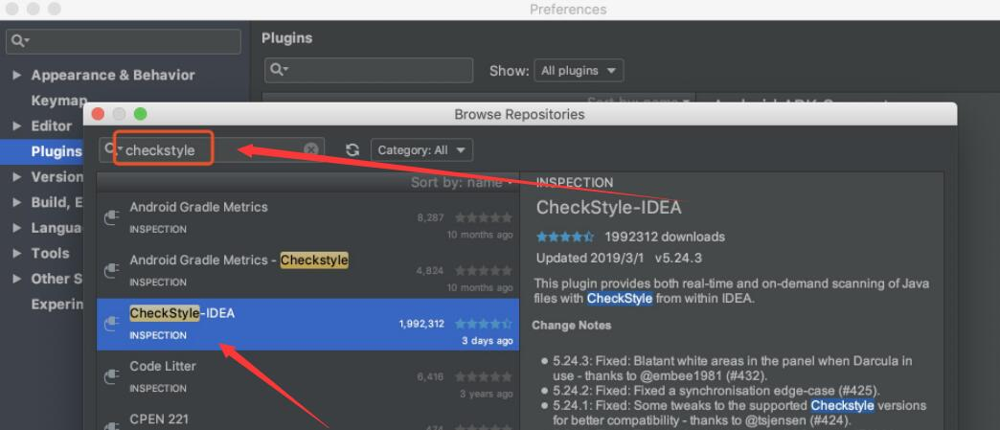
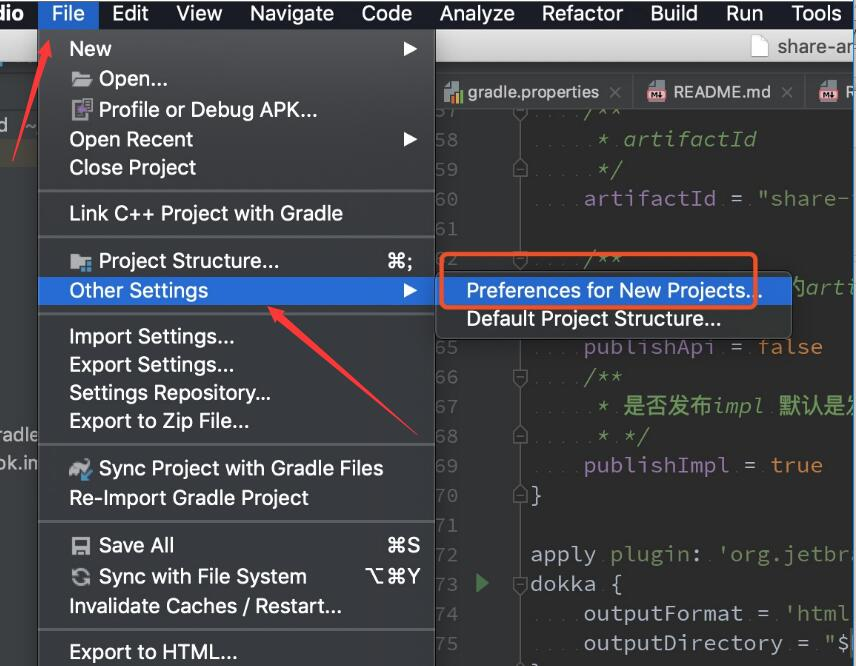
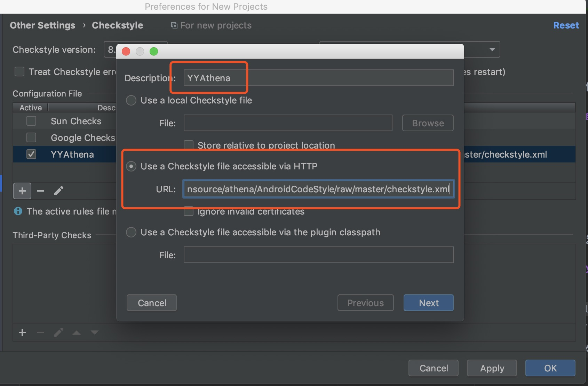
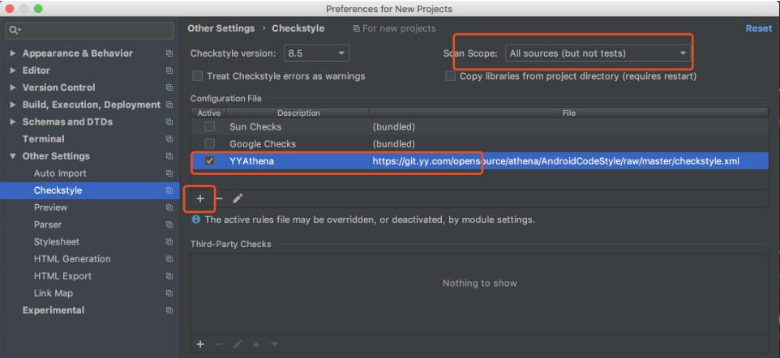
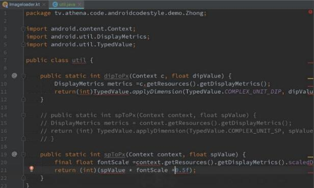
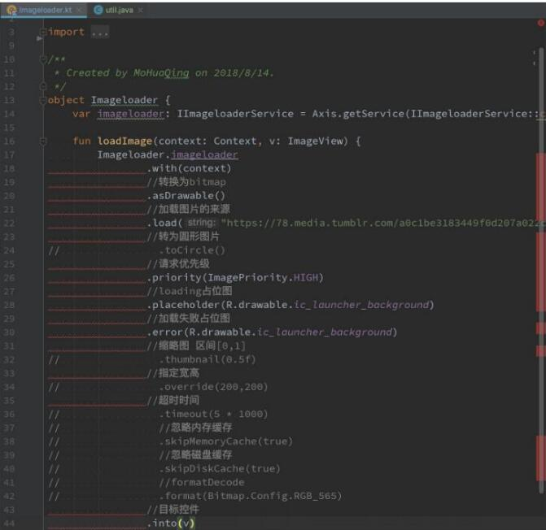

# YY Android 风格指南

## 1. 前言

为提升YY代码可读性与可维护性，特制定此规范。

除了Android(Java/Kotlin)编码风格说明外，本规范还包括匹配的IDE及构建配置，提升开发便利并确保规范能够严格执行。

## 2. 编码规范

详见[YY Android编码规范](codestyle.md)，基本参考自[Google Java Style Guide](https://google.github.io/styleguide/javaguide.html)。


## 3.  配置指引


由于Android目前官方编程语言有kotlin和java，我们在基本的checkstyle和codestyle之外还引入了ktlin。所以要配置代码规范需要三步走：
- 第一步， 设置好code style， 请详细阅读------"3.1 Android Studio 代码风格配置"
- 第二步，设置好checkstyle，请详细阅读------"3.2  Android Studio CheckStyle插件"
- 第三步，配置好architecture-lint插件，请详细阅读------"3.3 architecture-lint插件"

- ||||||||||||||||||||||||||||||||||||||||||||||||||||||||||||||||||||||||||||||||||
||||||||||||||||||||||||||||||||||||||||||||||||||||||||||||||||||||||||||||||||||

    `重点!!!重点!!!重点!!!`
    按照指引三步走之后，请一定查看文末的 ` 4.  tips---<kbd>重要，可少走弯路</kbd>`

    `可以节省时间提高效率`

- ||||||||||||||||||||||||||||||||||||||||||||||||||||||||||||||||||||||||||||||||||
||||||||||||||||||||||||||||||||||||||||||||||||||||||||||||||||||||||||||||||||||

### 3.1 Android Studio 代码风格配置

checkout 此项目(git clone https://git.yy.com/opensource/athena/AndroidCodeStyle.git )，进入idea_codestyle目录

* Windows平台运行脚本 `install.bat`，Mac平台运行 `install.sh`，将会增加一个Android Studio的配置文件
* 重启Android studio
* 在Settings -> Editor -> Inspections中选择YYAthena并应用 
* 在Settings -> Code Styles -> Scheme中确认YYAthena是否生效。

> 日常开发中，使用快捷键`Ctrl + Alt + L`(Mac: `⌘ + ⌥ + L`)格式化代码，可方便地保证基本风格符合标准。

### 3.2  Android Studio CheckStyle插件

按上面的步骤设置代码风格，能保证基本的换行、空格、缩进符合标准，进一步的检查可以按照CheckStyle插件来执行。

* 打开Android Studio的Settings -> Plugins -> Browse repositories...。输入CheckStyle，在结果中选择并安装CheckStyle-IDEA插件。
* 重启Android Studio。
* 打开Settings -> Other Settings -> Checkstyle，按左下角 `+` 号，增加检查配置。  
  * Description输入`YYAthena`
  * 选择`Use a Checkstyle file accessible via HTTP`
  * URL输入`https://git.yy.com/opensource/athena/AndroidCodeStyle/raw/master/checkstyle.xml`
  * 右上角Scan Scope: 由原来的Only Java sources (but not tests)改为All sources (but not tests), 以支持kotlin文件
  * 下一步并勾选应用
  如果想要每个项目都默认加上此规则，则找到Other Settings -> Preference for New Projects, 重复上面的设置，每个新开的project都会默认带上此规则，但已有的就要一个个项目改了

在源代码辑界面，不符合规范的命名、换行缩进等将会出现红色提示,Java和Kotlin都会给出提示
 

> 参考：[Google的原生CheckStyle配置](https://raw.githubusercontent.com/checkstyle/checkstyle/master/src/main/resources/google_checks.xml)

### 3.3 architecture-lint插件

- 为确保规范得到严格执行，须要在Jenkins构建环节增加检查，不符合规范的项目将邮件发送代码规范的报告(默认增量改动检测)。
- 本地构建也可以通过architecture-lint插件提供的task进行检查和format

附：构建检查Gradle配置(根项目build.gradle)


#### 配置.gitignore, 在root的.gitignore添加以下：

```
.editorconfig
.athena
```

#### 已接入中间件架构（apply plugin: 'architecture-api'）的项目

```groovy
apply plugin: 'architecture-lint'
```

#### 没有接入中间件架构的项目

```groovy
apply plugin: 'architecture-lint'

buildscript {
    //...
    dependencies {
        //...
        classpath "tv.athena:api-gradle-plugin:2.1.11"
        classpath "de.undercouch:gradle-download-task:3.2.0"
    }
    //...
}
//...

```

#### 在root project的build.gradle 增加以下代码

```
athenaLint {
    /**
     * 是否需要进行增量静态检测，默认是增量
     */
    increment = true

    /**
     * 是否在run的时候进行代码检测, 默认为false
     */
    alwaysrun = true
}

```
increment为true的时候只会检查修改过的代码，如果需要全量检查，请设置为false

#### sync project with gradle files

<div align=center></div>


#### task介绍
- athenaLint

    athenaLint是java和kotlin的静态代码检查task，其中针对java使用checkstyle， kotlin使用ktlint。
    调用该task会根据[YY Android编码规范](https://git.yy.com/wiki/athena/wiki/wikis/P7-YY-Android%E7%BC%96%E7%A0%81%E8%A7%84%E8%8C%83)
    检查项目代码，并且输出结果，支持全量和增量

- athenaKotlinFormatting

    athenaKotlinFormatting是代码的format task。调用该task会根据[YY Android编码规范](https://git.yy.com/wiki/athena/wiki/wikis/P7-YY-Android%E7%BC%96%E7%A0%81%E8%A7%84%E8%8C%83)
    对项目的代码进行format，修正不符合规则的。
    
    该task针对kotlin语言进行处理。 java语言使用Android Studio提供的reformat即可 Code --> Reformat Code


#### 按照上面步骤设置好task的参数，然后就可以根据自己的需求来使用athenaLint了

- run athenaLint, 检查代码
- run athenaKotlinFormatting with parameter "--continue", format kotlin代码

## 4.  tips---<kbd>重要，可少走弯路</kbd>

### 4.1.tips && guide (前提是已经按照上面三步走配置完毕)

如果设置了increment = true,那么就是增量检查，插件会选择当前分支从2019年3月11号以来所有修改过的文件来检查， 否则就是全量检查-插件会将所有文件都检查。

如果有直接源码引入的第三方库，需要过滤的 提供一下包名给我[yy联系：909018706]，譬如：cn/hikyson/godeye/monitor

> gradle兼容性问题--在windows下，会kotlin会强制全量检查，java无影响

#### 4.1.1检查代码常规步骤

- 使用task生成报告，在各module的build/report的checkstyle和ktlint文件夹都能查看报告

    ```
    //所有module生成报告 mac
    ./gradlew athenaLint --continue
    //所有module生成报告 windows
    gradlew athenaLint --continue
    
    //指定module生成报告 mac
    ./gradlew :modulename:athenaLint --continue
    //指定module生成报告 windows
    gradlew :modulename:athenaLint --continue
    ```

本地查看checkstyle文件，请先在文件浏览器中找到checkstyle.html,再用浏览器打开

- 灵活使用IDE自带的reformat code， 如找到报错的文件，然后通过快捷键先格式化一遍文件，如在windows下面就是：ctrl + alt + L
- 剩下的需要自己手动改了
- 引入了第三方源代码的请提供包名给我们进行过滤， 譬如：com/pierfrancescosoffritti/androidyoutubeplayer


#### 4.1.2 批量修改代码

- 运行athenaKotlinFormatting --continue可以批量修改kotlin代码
  
    ```
    //所有module自动格式化kotlin文件 mac
    ./gradlew athenaKotlinFormatting --continue
    //所有module自动格式化kotlin文件 windows
    gradlew athenaKotlinFormatting --continue
    
    //指定module自动格式化kotlin文件 mac
    ./gradlew :modulename:athenaKotlinFormatting --continue
    //指定module自动格式化kotlin文件 windows
    gradlew :modulename:athenaKotlinFormatting --continue
    ```
    
    > 请使用命令行

- 在项目module，右键可以选择批量reformat code(java) —  在左边项目文件目录选择project或者一个module—>右键->Reformat Code


- 请在root project运行athenaLint 或者 athenaKotlinFormatting--如果没有那就是配置出错或者IDE出问题，请联系我们.

### 4.2 常见问题
在开启了checkstyle后，经常有很多同学来咨询一些问题。这里归类一些常见的：

- 怎么批量reformat java code?

    ```
    //4.11tips && guide
    在左边项目文件目录选择project或者一个module—>右键->Reformat Code
    ```
    
    注意， 不要勾选上optimize imports
    
    <div align=center></div>

- 怎么批量reformat kotlin code?

    ```
    //4.11tips && guide
    ./gradlew athenaKotlinFormatting --continue
    ```

- 长度超过120了，有没有工具自动处理？
    ```
    
    请按照3.1 Android Studio 代码风格配置， 确认已经配置好了athena的代码风格配置文件
    然后可以通过reformat code来格式化代码
    
    ```

- 分号后需要有空格，能不能自动处理
    ```
    //目前暂时不支持，正在研究如何实现
        /**
         * 1.comment
         * ';' is not followed by whitespace. [WhitespaceAfter]
         */
        private static boolean checkTest = false;//测试注释
    ```


- athenaLint能不能单独只检查java或者kotlin?
    ```
    No, 每次检查都会一起检查
    ```

- 数组大括号位置错误 - “Array brackets at illegal position. [ArrayTypeStyle]” 是怎么回事？
    ```
    //c-style, not recommend
    String str1[] = link.split("/"); //Array brackets at illegal position. [ArrayTypeStyle]
    //prefer
    String[] str = link.split("/"); //Java style array declaration is prefer
    ```


- switch语句没有default能不能放宽？有些msg的定义是确切知道才处理的。
    ```
    //No, 请按照规则来，只要switch都增加default
        public void handleMessageLite(Message msg) {
            switch (msg.what) {
                case LiveMsgDef.LIVE_JOIN:
                    KLog.i("Test", "hello");
                    break;
                case LiveMsgDef.LIVE_CHANNEL_SHOW_USER_INFO_CARD:
                    KLog.i("Test", "hello");
                    break;
                default:
                    break;
            }
        }
    ```

- 为什么有些变量定义会提示  > Name 'XXX' must match pattern '^[a-z][a-zA-Z0-9]*$'


    - 凡是对成员变量或者本地变量(在方法中的或者代码块中的变量称为本地变量)声明为final的都叫作final变量。final变量经常和static关键字一起使用，作为常量。
    
        ```
        //bad , 只有常量才能全部大写, 否则请按照规则来命名
        private final int MAX_RECHARGE_AMOUNT_ALIPAY_APP = 2000;
        
        //fine
        private final static int MAX_RECHARGE_AMOUNT_ALIPAY_BPP = 2000;
        ```
    
    - Parcelable接口的实现类要有一个非空的静态变量 CREATOR
    
        ```
                public static final Creator<ParseNicknameInfo> CREATOR = new Creator<ParseNicknameInfo>() {
                    @Override
                    public ParseNicknameInfo createFromParcel(Parcel in) {
                        return new ParseNicknameInfo(in);
                    }
        
                    @Override
                    public ParseNicknameInfo[] newArray(int size) {
                        return new ParseNicknameInfo[size];
                    }
                };
        
        ```

- 控制台出现乱码怎么办？
	
	打开android-studio\bin文件夹，找到as的配置文件--sdudio64.exe.vmoptions, 增加以下参数
	```
	-Duser.language=en
	```
	

- 只检查单个module

    ```
    ./gradlew :modulename:athenaLint
    ```

- 我想在as设置run task: athenaLint && athenaKotlinFormatting， 怎么办？

    - 先双击athenaKotlinFormatting， 跑一遍。
    - Edit configurations, 为task增加一个--continue参数 (同理对athenaLint也可以按类似方法加入参数)
    
        > 加入--continue是为了gradle会检查完所有module的代码检查，避免检查了一个发现了checkstyle error就停止检查下一个


<div align=center></div>

 <div align=center></div>


> 加入--continue之后，需要点击绿色三角形可以每次帮你带上--continue参数 


- more question? yy联系：909018706


